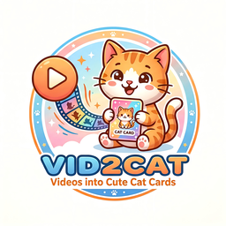

# vid2cat

<p align="center">
  
</p>

`vid2cat` 是一个基于 `FastAPI + Jinja2 + SQLite + Node.js + PicGo-Core` 的抖音驱动猫咪养成 Web 原型。

当前主玩法已经从早期的“抖音视频 -> 图鉴展示”演进为：

`注册 / 游客进入 -> 首次领养 -> 日常修炼 -> 抖音喂养升级 -> SSE 对话陪伴 -> 放入市场 / 重新领养`

## 当前能力

已经落地的核心链路：

- 用户注册、登录、退出，以及游客模式自动建号
- 首次领养时选择猫咪品种和颜色
- 首次领养基于品种和颜色自动生成初始形象
- 每个用户最多持有 3 只猫，并支持当前陪伴猫切换
- 对话和喂养共用一个输入框
- 普通文本走 SSE 流式聊天，并带逐字打印效果
- 抖音链接走异步喂养任务，完成后局部刷新猫咪状态
- 0 到 6 级成长体系、经验条、日常修炼、技能稀有度
- 猫咪市场发布与重新领养
- 图鉴页、评论、评分与管理员后台配置

## 推荐体验流程

1. 打开 `/my-cat`，游客也可以直接开始。
2. 第一次领养先选品种和颜色。
3. 先通过“晒太阳 / 冥想”把经验条练满。
4. 在统一输入框中输入内容：
   - 普通文本：进入陪伴聊天
   - 抖音链接：触发喂养升级
5. 每喂一个视频，猫咪会升级、学习新技能，并刷新形象与成长摘要。
6. 满级后仍可继续聊天，也可发布到市场等待新主人领养。

## 代码架构总览

当前项目是一个典型的单体 Web 应用，没有再拆成微服务，核心逻辑集中在 `src/vid2cat/` 下：

```text
vid2cat/
├─ src/vid2cat/
│  ├─ app.py                # FastAPI 入口、路由、页面拼装、异步任务管理
│  ├─ db.py                 # SQLite 初始化、迁移补列、业务数据读写
│  ├─ services.py           # 抖音解析、AI 提示词、猫设生成、聊天/喂养编排
│  ├─ integrations.py       # OpenAI 兼容模型调用、PicGo 图床适配
│  ├─ static/
│  │  ├─ app.js             # 前端交互：SSE 聊天、任务轮询、局部刷新
│  │  ├─ style.css          # 全站样式
│  │  └─ favicon.png        # 当前网站 favicon
│  ├─ templates/
│  │  ├─ index.html         # 主要基础布局
│  │  ├─ my_cat.html        # 核心养成页面
│  │  ├─ plaza.html         # 猫咪市场
│  │  ├─ atlas_list.html    # 图鉴列表
│  │  ├─ atlas_detail.html  # 图鉴详情
│  │  ├─ login.html
│  │  ├─ register.html
│  │  ├─ admin_login.html
│  │  ├─ admin_password.html
│  │  └─ admin_dashboard.html
│  └─ __init__.py
├─ scripts/
│  └─ upload.js             # PicGo-Core 上传脚本
├─ data/                    # SQLite 数据库与运行时文件
├─ 哈吉咪LOGO方.png         # 项目 Logo 源图
├─ pyproject.toml           # Python 依赖与入口脚本
├─ package.json             # Node.js 图床依赖
├─ docker-compose.yml
├─ docker-compose.dev.yml
└─ README.md
```

## 分层说明

### 1. 页面入口层：`app.py`

`src/vid2cat/app.py` 是整个应用的总入口，职责非常集中：

- 创建 `FastAPI` 应用、Session 中间件和 `/static` 静态资源挂载
- 定义页面路由、表单提交接口和 JSON / SSE 接口
- 组织模板上下文，把数据库数据加工成页面可直接消费的结构
- 管理异步喂养任务状态 `ASYNC_TASKS`
- 提供 `/api/my-cat/current` 给前端做局部热刷新

可以把它理解成当前项目的“控制器层 + 页面编排层”。

### 2. 业务服务层：`services.py`

`src/vid2cat/services.py` 负责业务规则和 AI 相关编排，是当前最像“领域服务”的部分：

- 识别输入是否包含抖音链接
- 解析抖音页面数据、抽取视频信息
- 组织模型 1 / 2 / 3 的提示词与调用输入
- 维护统一的“喵喵系角色”人设约束
- 生成初始领养人设、成长后人设、聊天回复和图像提示词

这层不直接处理模板，但决定了“猫怎么成长、怎么说话、怎么生成形象”。

### 3. 数据持久层：`db.py`

`src/vid2cat/db.py` 同时承担了数据库初始化、轻量迁移和数据访问职责：

- 初始化 `users`、`cats`、`cat_feed_records`、`cat_messages`、`atlases` 等表
- 通过 `ensure_column()` 在旧库上做补列式迁移
- 封装用户、猫咪、市场、图鉴、评论、评分、配置的增删改查
- 实现等级、经验、训练、重新领养等核心持久化逻辑

目前它更像“Repository + Service 混合体”，优点是直观，缺点是随着业务继续增长会逐渐变厚。

### 4. 外部集成层：`integrations.py`

`src/vid2cat/integrations.py` 负责统一封装外部依赖：

- `AIModelRuntime`：OpenAI 兼容文本和绘图接口调用
- `ImageHostScaffold`：图像上传和镜像上传
- `PromptEngineScaffold`：预留的提示词 scaffold

这层把“调用外部服务”的细节从业务逻辑里隔离出来，后续如果替换模型供应商或图床，改动面会更小。

### 5. 模板视图层：`templates/`

模板当前采用 Jinja2，结构上是“一个主基底 + 多个业务页面”的形式：

- `index.html`：主要公共头部与首页布局，也作为大部分页面的基础模板
- `my_cat.html`：主玩法页面，承载领养、切换、训练、聊天、喂养、成长展示
- `plaza.html`：市场页
- `atlas_list.html` / `atlas_detail.html`：图鉴页
- `admin_dashboard.html`：后台配置页
- `login.html` / `register.html` / `admin_login.html` / `admin_password.html`：独立表单页

### 6. 前端交互层：`static/app.js`

`src/vid2cat/static/app.js` 是目前前端动态行为的核心：

- 判断输入内容是“聊天”还是“喂养”
- 走 `fetch + SSE` 接收聊天 token，并做逐字打印
- 提交喂养任务后轮询 `/api/tasks/{task_id}`
- 任务完成后调用 `/api/my-cat/current` 局部刷新猫咪卡片
- 处理评分星级等交互

所以当前前端虽然是传统模板渲染，但关键体验已经是“服务端模板 + 轻交互 JS”的模式。

## 当前请求流

### 聊天流

1. 页面在 `my_cat.html` 提交到 `/api/my-cat/chat/stream`
2. `app.py` 读取当前猫和最近消息
3. `services.py` 生成聊天回复
4. 后端通过 `StreamingResponse` 按 token 推送
5. `app.js` 逐字打印并把最终回复写回界面

### 喂养流

1. 用户在统一输入框贴入抖音链接
2. `app.js` 识别为喂养请求，提交到 `/api/my-cat/feed`
3. `app.py` 创建异步任务并启动 `run_feed_task()`
4. `services.py` 解析视频、生成成长资料与新图像
5. `db.py` 写入喂养记录、等级、技能、最新形象
6. 前端轮询任务状态，完成后调用 `/api/my-cat/current` 局部刷新

### 图鉴流

1. 用户访问 `/atlases` 或 `/atlas/{atlas_id}`
2. `app.py` 读取图鉴记录、评分、评论
3. `services.py` 负责解析猫设与模型输出展示数据
4. 模板渲染图鉴详情、评论和评分组件

## 三模型职责

### 模型 1：视频分析

用途：

- 输出结构化视频摘要、标签和分数
- 为喂养属性变化和图鉴分析提供基础数据

### 模型 2：猫设生成

用途：

- 生成初始领养猫设
- 生成图鉴态设定
- 生成成长后的稳定人格
- 为聊天回复提供角色约束

### 模型 3：图像生成

用途：

- 根据当前视频摘要和当前猫资料生成新猫图

当前实现中，生成后的图片会统一转成最终可访问 URL 再落库。

## 核心页面

### `/my-cat`

这是当前主页面，承载：

- 我的三只猫切换
- 首次领养 / 再领养
- 经验条和成长规则
- 日常训练
- 聊天和喂养统一输入框
- 异步进化状态展示
- 当前属性、技能、人格和成长摘要

### `/plaza`

这是当前的市场页面，承载：

- 公开猫咪展示
- 放入市场后的重新领养
- 满级原主人信息保留

### `/atlases` 与 `/atlas/{atlas_id}`

这是旧图鉴能力的保留入口，目前仍有价值：

- 兼容早期“视频 -> 图鉴”的链路
- 作为模型分析结果的展示页
- 给后台调试提示词和输出结构提供参考

### `/admin`

管理员后台负责：

- 模型 1 / 2 / 3 的 API 配置
- 图床配置
- 图床上传测试
- 最近注册用户查看

## 数据模型

SQLite 默认路径：

- `data/vid2cat.db`

当前核心表：

- `users`：正式用户、管理员、游客用户
- `cats`：猫咪主表，包含等级、经验、形象、人格、市场状态
- `cat_feed_records`：每次喂养对应的视频与属性变化
- `cat_training_records`：日常修炼记录
- `cat_messages`：聊天记录
- `atlases`：图鉴主表
- `comments` / `ratings`：图鉴互动
- `app_settings`：后台配置项

## 技术栈

- Python 3.12+
- FastAPI
- Jinja2
- SQLite
- httpx
- json-repair
- Node.js
- PicGo-Core
- picgo-plugin-github-plus

## 安装与启动

### 1. 安装 Python 依赖

```bash
uv sync
```

### 2. 安装 Node.js 依赖

```bash
npm install
```

### 3. 启动服务

开发环境可直接运行：

```bash
uv run uvicorn vid2cat.app:app --host 127.0.0.1 --port 8080
```

或使用项目入口：

```bash
uv run vid2cat
```

`pyproject.toml` 中的入口为：

```toml
[project.scripts]
vid2cat = "vid2cat:main"
```

注意：

- 当前部署约定端口优先使用 `8080`
- `docker-compose` 仅建议挂载 `data/` 目录

## 管理员账号

首次启动若数据库内没有管理员，会自动创建：

- 用户名：`admin`
- 密码：`ChangeMe123!`

首次登录后台后会强制修改密码。

## 后台配置项

### AI 模型配置

- `ai_model_1_api_url`
- `ai_model_1_api_key`
- `ai_model_1_model`
- `ai_model_2_api_url`
- `ai_model_2_api_key`
- `ai_model_2_model`
- `ai_model_3_api_url`
- `ai_model_3_api_key`
- `ai_model_3_model`

### 图床配置

- `gitee_repo`
- `gitee_branch`
- `gitee_path`
- `gitee_token`
- `gitee_custom_url`
- `extra_upload_token`

## 当前实现特点

- 后端是单体结构，便于快速迭代
- 前端采用服务端模板渲染，关键交互通过原生 JS 增强
- 聊天采用 SSE 流式输出并做逐字打印
- 喂养与生图采用异步任务，避免阻塞页面
- 图像上传由 Python 后端协调、Node.js 脚本落地

## 后续可以继续拆分的方向

- 把 `app.py` 中的页面路由与 API 路由拆成更清晰的模块
- 把 `db.py` 中的查询函数按用户 / 猫咪 / 图鉴 / 后台配置拆分
- 给异步任务引入更稳定的任务队列或持久化状态
- 把“喵喵系角色”提示词抽成后台可配置模板
- 为市场和猫咪补更完整的详情页
